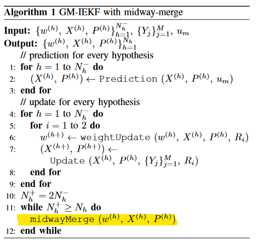
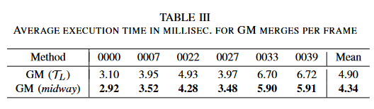

# Gaussian Mixture Midway-Merge for Object SLAM with Pose Ambiguity具有姿态模糊性的物体SLAM的高斯混合中间合并学习笔记

## 预备知识

### 1、李群（Matrix Lie group）和李代数（用向量表示特殊正交群）定义反对称运算

忘了看一下[李群和李代数 —— 名字听起来很猛其实也没那么复杂 - 知乎 (zhihu.com)](https://zhuanlan.zhihu.com/p/358455662)
$$
exp(x^∧) = X, ln(X)^∨ = x
$$
slam用SO(3)和SE(3)都是矩阵李群，强调这个比较无所谓

### 2、贝克-坎贝尔-豪斯多夫公式Baker-Campbell-Hausdorff (BCH)

本文使用的是BCH的近似公式如下：
$$
ln (exp(x_1^∧ ) exp(x∧ 2 ))^∨ ≈ x_1 + J_l(−x_1)^{-1}x_2
$$
用于李代数求导，假设x2恒为小量，如求导时的Δ

### 3、李群上的高斯分布

李群上的高斯分布这个没有太直接的wiki，但是在不少文章中反复提到这个概念

本文给出的定义是
$$
X = exp(−ξ^∧)\hat{X}.其中ξ ∼ N (0, P )
$$
其中$\hat X$ 意为均值矩阵，这里的理解是$X$ 是加高斯分布的矩阵，而$\hat X$ 等价于实际值，而$exp(−ξ^∧)$ 为其增加了一个用李代数表示的均值为0的高斯分布，叠加在李群上，等价于对噪声的估计

==疑问：为何用$exp(−ξ^∧)$根据高斯分布的定义，负号的存在应当是对结果是无影响的== 

Answer：确实是都行

进而通过恒等式
$$
1=\int _R^{N}(2π)^{−\frac{N}{2}} |P|^{−\frac{1}{2}} exp({−\frac{1}{2}}ξ^TP^{−1}ξ)dξ=\int _Gη exp({−\frac{1}{2}} ln(\hat{X}X^{−1})^{∨^T} P^{−1}ln(\hat{X}X^{−1})^∨)dX
$$
(没看懂啥意思)

但是定义了李群上的高斯分布的表示
$$
X ∼ N_G(\hat{X}, P )
$$
另外在Gaussian mixture中，可以进一步表示成
$$
\sum_{i}w_iN_G(\hat{X}_i, P_i )
$$
其中$w_i$表示为权重项，总和为1，**说白了Gaussian mixture就是用高斯分布的线性组合（会不会有非线性的组合？）去近似不符合高斯分布的噪声估计**

### 4、向量空间的保矩归并

通俗的讲的话，一阶矩就是均值 二阶矩就是方差。而这正是高斯分布的两个参数，说白了就是用俩参数（虽然可以展开的表示）表示一个Gaussian mixture，对于二阶矩的表示是不是那么直接的，类似协方差
$$
w^∗_{1} N (\hat{x_1}, P_1) +w^∗_{2} (\hat{x_1}, P2) \\
\hat{x_m}=w^∗_{1}\hat{x_1}+w^∗_{2}\hat{x_2}\\
P_m=w^∗_{1}P_1+w^∗_{2}P_2+w^∗_{1}w^∗_{2}(\hat{x_1}-\hat{x_2})(\hat{x_1}-\hat{x_1})^T
$$
5、一个名词注解，文中用PDF称呼probability density functions （概率密度函数）

## GAUSSIAN MIXTURE MERGE高斯混合归并

### 1、变换后均值的不确定度

本文讨论了两个点之间的高斯混合，指出了直接混合的话不能获得正确的不确定度估计

这步的证明没太看懂，大意是解释了直接进行两临近点的高斯混合，无比需要保证两点非常近，若不满足，由
$$
exp(∆x^∧_i ) := \hat{X}_i \hat{X}^{−1}_c
$$
导出的在公共点上的混合高斯分布$ξ_c ∼ N (−∆x_i,\bar{P_i})$不再符合实际

### 2、midway-merge

通过假设一个中间点，并假设该点有两个可用高斯分布表征的点$X_1$和$X_2$，将两边不同的分量转到中点估计出中点的高斯分布

进而给出了更准确的融合后的表征形式，推导过程比较机械，略

与之前的区别，由中点计算边界点得到点的高斯混合分布还是由边界点导出中点的高斯混合分布

不准确的：
$$
ξ_c ∼ N (−∆x_i,\bar{P_i})\\
exp(∆x^∧_i ) := \hat{X}_i \hat{X}^{−1}_c\\
\hat{P_i} = J_l^{-1} (∆x_i)P_iJ_l ^{-T} (∆x_i)
$$
准确的：
$$
ξ_f ∼ N (−∆x_f,\bar{P_f})\\
exp(∆x^∧_f ) := 0(见推导)\\
\hat{P_f} = w_1^*\hat{P_1}+ w_2^*\hat{P_2}+w_1^*w_2^*\Delta x \Delta x^T
$$
关键部分是确定$exp(∆x^∧_f ) := 0$保证了中点在切空间上

在误差分析中，除了边界点与中点重合是，midway-merge总是小于传统的高斯混合

## 高斯混合归并的应用

优化卡尔曼滤波使其获得更优结果（精度对比试验未在代码中）

为高斯混合-迭代卡尔曼滤波使用midway-merge更换了传统高斯混合

精度速度均取得更优效果

## 开源代码实验

对于单个物体效果不错，能够较好追踪，但是多物体效果明显变差

实验思考：在运行时不能调度cpu全部核心，使用parfor并行运算后时间反而延长

### 运行中的小问题

#### 1、运行时cpu占用低

正常运行demo时cpu占用不到15%

.png)

#### 2、使用parfor优化后cpu和内存占用更高，但是运算速度降低.png)

对比不使用parfor结果.png)

3、在图片演示中使用并行for能提高效率，cpu占用也会提升至60%，且极易爆内存

